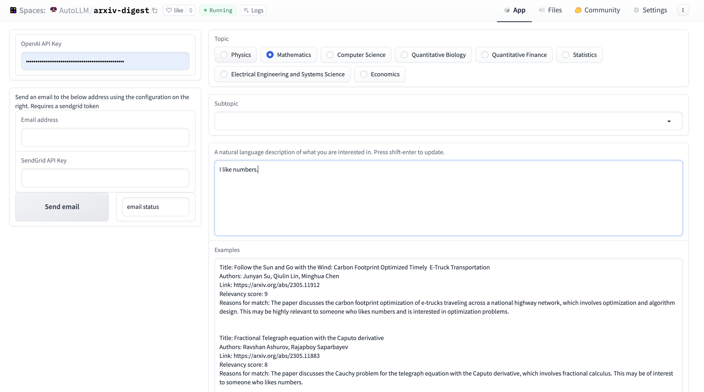
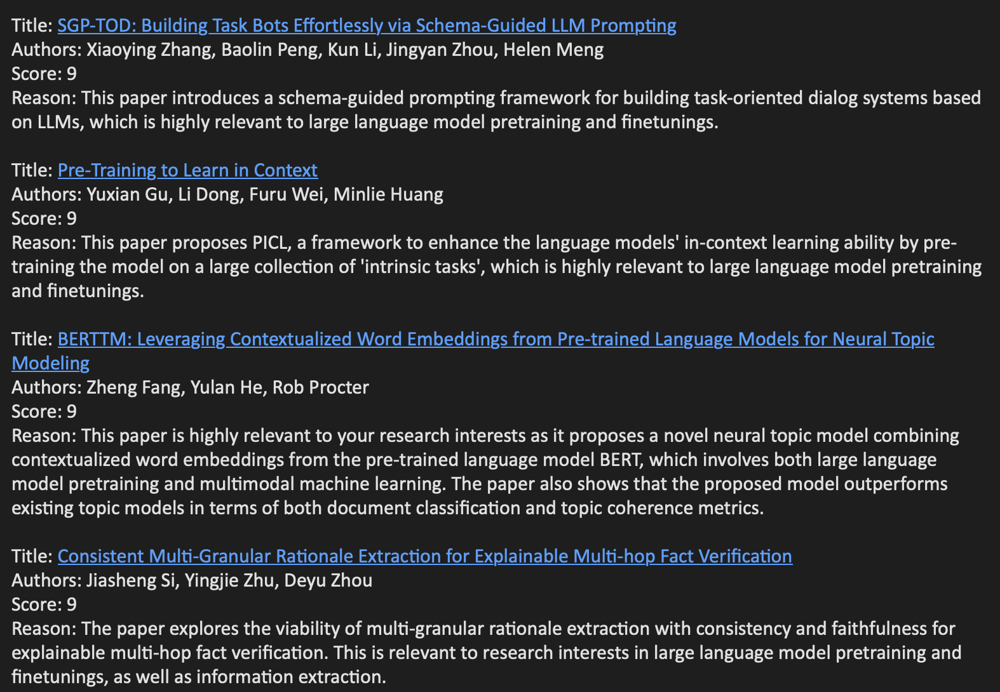

**ArXiv Digest and Personalized Recommendations using Large Language Models.**

This repo aims to provide a better daily digest for newly published arXiv papers based on your own research interests and natural-language descriptions, using relevancy ratings from GPT.

You can try it out on [Hugging Face](https://huggingface.co/spaces/AutoLLM/ArxivDigest) using your own OpenAI API key.

You can also create a daily subscription pipeline to email you the results.

## 📚 Contents

- [What this repo does](#🔍-what-this-repo-does)
  * [Examples](#some-examples)
- [Usage](#💡-usage)
  * [Running as a github action using SendGrid (Recommended)](#running-as-a-github-action-using-sendgrid-recommended)
  * [Running as a github action with SMTP credentials](#running-as-a-github-action-with-smtp-credentials)
  * [Running as a github action without emails](#running-as-a-github-action-without-emails)
  * [Running from the command line](#running-from-the-command-line)
  * [Running with a user interface](#running-with-a-user-interface)
- [Roadmap](#✅-roadmap)
- [Extending and Contributing](#💁-extending-and-contributing)

## 🔍 What this repo does

Staying up to date on [arXiv](https://arxiv.org) papers can take a considerable amount of time, with on the order of hundreds of new papers each day to filter through. There is an [official daily digest service](https://info.arxiv.org/help/subscribe.html), however large categories like [cs.AI](https://arxiv.org/list/cs.AI/recent) still have 50-100 papers a day. Determining if these papers are relevant and important to you means reading through the title and abstract, which is time-consuming.

This repository offers a method to curate a daily digest, sorted by relevance, using large language models. These models are conditioned based on your personal research interests, which are described in natural language. 

* You modify the configuration file `config.yaml` with an arXiv Subject, some set of Categories, and a natural language statement about the type of papers you are interested in.  
* The code pulls all the abstracts for papers in those categories and ranks how relevant they are to your interest on a scale of 1-10 using `gpt-3.5-turbo-16k`.
* The code then emits an HTML digest listing all the relevant papers, and optionally emails it to you using [SendGrid](https://sendgrid.com). You will need to have a SendGrid account with an API key for this functionality to work.  

### Testing it out with Hugging Face:

We provide a demo at [https://huggingface.co/spaces/AutoLLM/ArxivDigest](https://huggingface.co/spaces/AutoLLM/ArxivDigest). Simply enter your [OpenAI API key](https://platform.openai.com/account/api-keys) and then fill in the configuration on the right. Note that we do not store your key.

You can also send yourself an email of the digest by creating a SendGrid account and [API key](https://app.SendGrid.com/settings/api_keys).

### Some examples of results:

#### Digest Configuration:
- Subject/Topic: Computer Science
- Categories: Artificial Intelligence, Computation and Language 
- Interest: 
  - Large language model pretraining and finetunings
  - Multimodal machine learning
  - Do not care about specific application, for example, information extraction, summarization, etc.
  - Not interested in paper focus on specific languages, e.g., Arabic, Chinese, etc.

#### Result:

#### Digest Configuration:
- Subject/Topic: Quantitative Finance
- Interest: "making lots of money"

#### Result:

## 💡 Usage

### Running as a github action using SendGrid (Recommended).

The recommended way to get started using this repository is to:

1. Fork the repository
2. Modify `config.yaml` and merge the changes into your main branch.
3. Set the following secrets [(under settings, Secrets and variables, repository secrets)](https://docs.github.com/en/actions/security-guides/encrypted-secrets#creating-encrypted-secrets-for-a-repository). See [Advanced Usage](./advanced_usage.md#create-and-fetch-your-api-keys) for more details on how to create and get OpenAi and SendGrid API keys:
   - `OPENAI_API_KEY` From [OpenAI](https://platform.openai.com/account/api-keys)
   - `SENDGRID_API_KEY` From [SendGrid](https://app.SendGrid.com/settings/api_keys)
   - `FROM_EMAIL` This value must match the email you used to create the SendGrid API Key.
   - `TO_EMAIL`
4. Manually trigger the action or wait until the scheduled action takes place.

See [Advanced Usage](./advanced_usage.md) for more details, including step-by-step images, further customization, and alternate usage.

### Running with a user interface

To locally run the same UI as the Huggign Face space:
 
1. Install the requirements in `src/requirements.txt` as well as `gradio`.
2. Run `python src/app.py` and go to the local URL. From there you will be able to preview the papers from today, as well as the generated digests.
3. If you want to use a `.env` file for your secrets, you can copy `.env.template` to `.env` and then set the environment variables in `.env`.
- Note: These file may be hidden by default in some operating systems due to the dot prefix.
- The .env file is one of the files in .gitignore, so git does not track it and it will not be uploaded to the repository.
- Do not edit the original `.env.template` with your keys or your email address, since `.template.env` is tracked by git and editing it might cause you to commit your secrets.

> **WARNING:** Do not edit and commit your `.env.template` with your personal keys or email address! Doing so may expose these to the world!

## ✅ Roadmap

- [x] Support personalized paper recommendation using LLM.
- [x] Send emails for daily digest.
- [ ] Implement a ranking factor to prioritize content from specific authors.
- [ ] Support open-source models, e.g., LLaMA, Vicuna, MPT etc.
- [ ] Fine-tune an open-source model to better support paper ranking and stay updated with the latest research concepts..

## 💁 Extending and Contributing

You may (and are encourage to) modify the code in this repository to suit your personal needs. If you think your modifications would be in any way useful to others, please submit a pull request.

These types of modifications include things like changes to the prompt, different language models, or additional ways for the digest is delivered to you.
